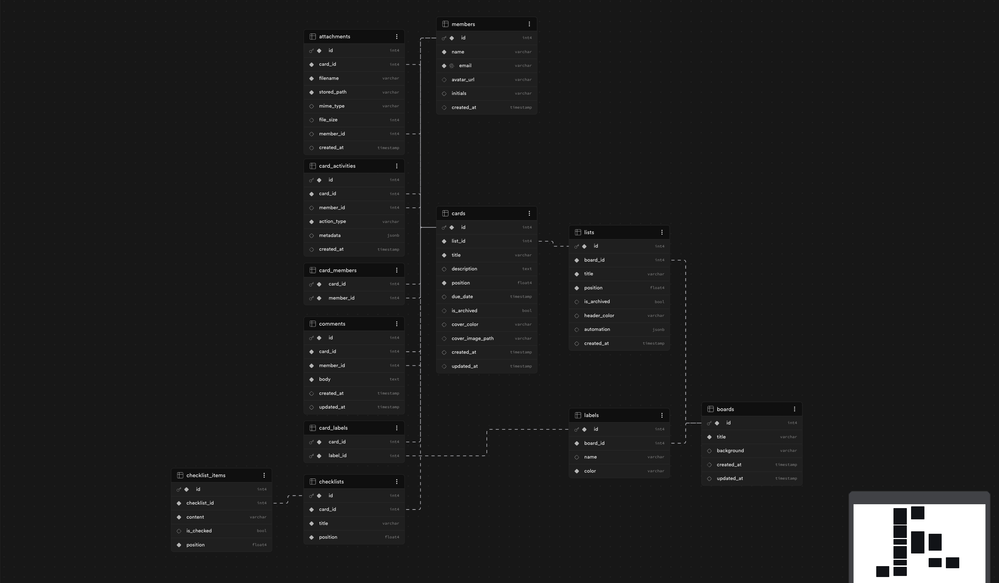

# Trello Clone — Project Management Tool

A full-stack Kanban-style project management web application replicating Trello's design and user experience.

**Walkthrough video** — [Project walkthrough (Google Drive)](https://drive.google.com/file/d/1PjjJ9qaCsEzNmMs29f0AFW0m4G-oA_0q/view?usp=sharing).

**Implementation report** — For a full write-up of features (including screenshots), see: [Trello Clone — Implementation Report](https://docs.google.com/document/d/1Vnep8IxgUiAze0CZnxwXY9uXiwcB5Ih0Fi7zeL8zS0U/edit?usp=sharing).

## Tech Stack

| Layer | Technology |
|-------|-----------|
| **Frontend** | Next.js 14 (App Router, JavaScript) |
| **Backend** | Node.js + Express.js |
| **Database** | PostgreSQL (Supabase) |
| **Drag & Drop** | @hello-pangea/dnd |
| **Styling** | Vanilla CSS |

## Features

- **Board Management** — Create and view boards
- **Lists Management** — Create, edit, delete, and drag-to-reorder lists
- **Cards Management** — Create, edit, delete cards with drag-and-drop between lists
- **Card Details** — Labels, due dates, checklists, member assignment
- **Search & Filter** — Search cards by title, filter by labels/members/due dates
- **Drag & Drop** — Smooth reordering of both lists and cards

## Setup Instructions

### Prerequisites
- Node.js v18+ (v20+ recommended)
- A Supabase project (free tier works)

### 1. Clone the repository
```bash
git clone <repo-url>
cd trello
```

### 2. Backend Setup
```bash
cd server
cp .env.example .env
# Edit .env: use Supabase Connect → Session pooler (or Transaction pooler), not Direct,
# unless you use IPv6 or Supabase IPv4 add-on — see server/.env.example
npm install
npm run seed    # Creates tables and seeds sample data
npm run dev     # Starts on http://localhost:5001
```

### 3. Frontend Setup
```bash
cd client
npm install
npm run dev     # Starts on http://localhost:3000
```

### 4. Open the app
Visit `http://localhost:3000` in your browser.

## Database Schema

The data model follows a **board → list → card** hierarchy. Boards own lists and board-level labels; cards live in lists and can have checklists, comments, attachments, activities, assigned members, and applied labels (many-to-many via junction tables).



**Source of truth:** Exact column types, keys, and indexes are defined in [`server/schema.sql`](server/schema.sql). Use that file when implementing or extending features (the diagram above is for orientation).

**Tables (summary):**

| Area | Tables |
|------|--------|
| Core | `boards`, `lists`, `cards` |
| Labels | `labels`, `card_labels` |
| People | `members`, `card_members` |
| Card detail | `checklists`, `checklist_items`, `comments`, `attachments`, `card_activities` |

List and card **position** fields use `REAL` (float) for efficient reordering without renumbering.

## Assumptions

- No authentication required — a default user is pre-seeded
- Sample data is seeded via `npm run seed`
- PostgreSQL hosted on Supabase (connection via `DATABASE_URL`)
- CORS configured for `http://localhost:3000` (Next.js dev server)
